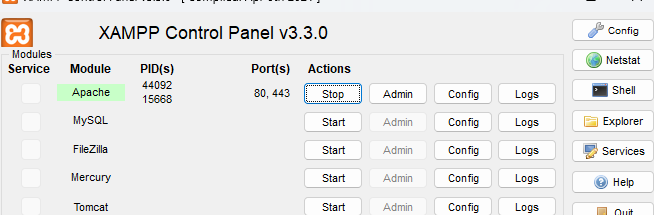
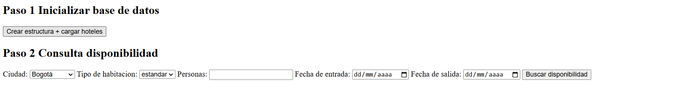

# AXD
Desarrollo de prueba.
consideraciones.

Tener instalado xammp
Tener instalado el software de desarrollo de prueba en este caso PHP >8.1

para correr el proyecto deberas ingresar a xammp htcdoc y alli alohar el direcctorio llamado hotel_reservas.

Validar que xammp este arriba 

Ir aa la direcion de http://localhost/hotel_reservas/public/index.php esto ya nos mostrara el servicio arriba como se ve en imagen 

Seguir los pasos que indica el index 1 que seria cargar datos a sqlite
luego hacer consulta de disponibilidades. 